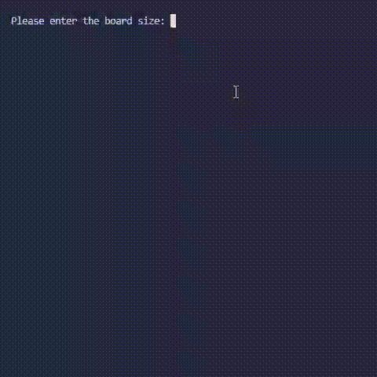

# minimax-checkers-simulation

Configurable checkers simulation driven by a minimax AI with alpha-beta pruning. Supports multiple opponent modes, step-by-step board visualization, and game tree complexity analysis with a generated report.



## Features

- **Configurable board** — any size from 3×3 upward
- **Minimax + alpha-beta pruning** — adjustable search depth
- **Three opponent modes** — Random, Suboptimal (1-ply greedy), Minimax
- **Visualization** — step-by-step board rendering with configurable delay
- **Tree analysis** — estimates branching factor, max depth, and tree size via `b^(d/2)` formula
- **Report generation** — saves full game stats and move history to a `.txt` file

## Requirements

Python 3.10+

## Usage

```bash
python src/main.py
```

Follow the prompts to configure board size, search depth, opponent mode, and visualization.

## Sample report

```
Average tree branching factor: 1.55
Deepest node: 32 
Estimated minimax tree size based on limit of 100000 recursive calls: 65536

-------------------------------------------------------------

Minimax algorithm report in checkers for depth 8: 

Opponent mode: Mini-max 

Game played on board: 5 x 5. 
Winner: White. 
White player moves: 6
Red player moves: 5
White player score: 6 
Red player score: 1 
-------------------------------------------------------------
```
